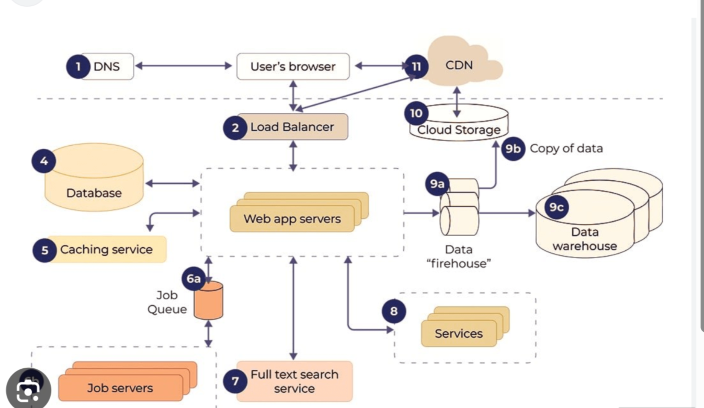

# Smart India Hackathon Workshop
# Date: 11:03:2025
## Register Number: 212224230289
## Name: Tharun R
## Problem Title
SIH 1653: Web based Selector-Applicant Simulation Software
## Problem Description
Background: Recruitment and Assessment Centre (RAC) under DRDO, Ministry of Defence carries out interviews for applications received against advertised vacancies and for promotion to next higher grade for scientific manpower inducted within DRDO. Description: The process of interviewing is a challenging task. An unbiased objective interviewing process helps identify the right talent. The basic process of an interview involves posing a set of questions by an interviewer and thereafter evaluating responses from candidates. Thus, the questions asked should be relevant and match the area/ expertise of the applicant and the responses should also be of relevance w.r.t. the question asked. Expected Solution: The proposed solution should provide experts as well as candidates a real life Board Room experience, starting with initial ice-breaking questions leading to in-depth techno-managerial (depending on the level of candidate) questions. It shall also be able to provide a quantifiable score for experts as well as the candidate for the relevancy of questions w.r.t. the area/ expertise of the applicant. Similarly, candidate responses should also be graded for relevancy w.r.t. the question asked, finally assisting in arriving at an overall score for the subject knowledge of the candidate and thus his/ her suitability against the advertised post.

## Problem Creater's Organization
Ministry of Defence

## Idea
Idea
1.Role-Based Simulation Selector Mode: Users can act as recruiters, screening applications, conducting interviews, and making hiring decisions. Applicant Mode: Users can apply for jobs, take assessments, and go through simulated interviews.

2.AI-Powered Resume Screening Uses AI to scan and rank resumes based on job requirements.Provides real-time feedback on resume strength.

3.Realistic Interview Process Live and Pre-Recorded Video Interviews: Applicants answer AI-generated or recruiter-selected questions. Behavioral and Technical Questioning: Uses STAR method and job-specific assessments.

4.Candidate Assessment & Scoring :Skill-based testing (coding, aptitude, personality tests). Automatic grading with detailed feedback.

5.Decision-Making Analytics for Selectors: AI-driven insights on candidate performance. Comparison tools to evaluate multiple applicants.

6.Training & Feedback Module: Applicants receive feedback on their performance. Selectors get training on bias reduction, interview techniques, and data-driven hiring.

7.Customization & Integration: Custom job roles, criteria, and workflows. Integration with existing HR systems (ATS, LinkedIn, etc.).

8.Multi-User Collaboration:Teams can discuss candidates and collaborate on hiring decisions. Voting and scoring system for fairness in selection.

## Proposed Solution / Architecture Diagram

## Use Cases
HR Training: Train recruiters on better hiring practices. Job Seeker Preparation: Help candidates practice interviews and improve applications. University Career Services: Provide students with real-world hiring simulations.

## Technology Stack
Frontend (User Interface - UI)

Backend (Business Logic & APIs)

Database

Simulation Engine

Authenatication and Authorization

Cloud and Hosting

Machine learning and AI

## Dependencies
Mapping service- 30 days

Data collection- 15 days

budget- rs.80,000
